# DUGate — Solution Architecture Document

> **Document ID**: SA-DUGATE-2026-001  
> **Version**: 1.0  
> **Classification**: INTERNAL — FOR APPROVAL  
> **Author**: Solution Architecture Team  
> **Date**: 2026-04-03  
> **Status**: DRAFT — Pending Approval

---

## Table of Contents

1. [Executive Summary](#1-executive-summary)
2. [Business Context & Problem Statement](#2-business-context--problem-statement)
3. [Solution Overview](#3-solution-overview)
4. [Architecture Principles](#4-architecture-principles)
5. [System Context (C4 Level 1)](#5-system-context-c4-level-1)
6. [Container Architecture (C4 Level 2)](#6-container-architecture-c4-level-2)
7. [Component Architecture (C4 Level 3)](#7-component-architecture-c4-level-3)
8. [Data Architecture](#8-data-architecture)
9. [Sequence Diagrams](#9-sequence-diagrams)
10. [Deployment Architecture — Docker & Kubernetes](#10-deployment-architecture--docker--kubernetes)
11. [Security Architecture](#11-security-architecture)
12. [Non-Functional Requirements (NFR)](#12-non-functional-requirements-nfr)
13. [Technology Stack Decision Matrix](#13-technology-stack-decision-matrix)
14. [Risk Assessment & Mitigation](#14-risk-assessment--mitigation)
15. [Approval Sign-off](#15-approval-sign-off)

---

## 1. Executive Summary

**DUGate** (Document Understanding API Gateway) là một giải pháp kiến trúc cổng trung gian API nội bộ, chuyên biệt xử lý các bài toán **Phân tích Tài liệu** (Document Understanding) cho môi trường doanh nghiệp — đặc biệt phù hợp với ngành Tài chính & Ngân hàng.

Thay vì mỗi nghiệp vụ tự tích hợp riêng lẻ đến hàng chục dịch vụ OCR/LLM bên ngoài, DUGate **quy chuẩn hóa** toàn bộ lớp truy cập thành **6 API Endpoint duy nhất**, vận hành trên kiến trúc **Pipeline Engine bất đồng bộ** với khả năng **định tuyến theo Profile**, đảm bảo:

- **Zero-coupling** giữa ứng dụng nghiệp vụ và AI backend
- **Multi-tenant isolation** qua API Key + Profile-based routing
- **Audit-grade traceability** với structured logging & cURL reconstruction
- **Enterprise-grade deployment** trên Docker & Kubernetes

---

## 2. Business Context & Problem Statement

### 2.1 Hiện trạng (AS-IS)

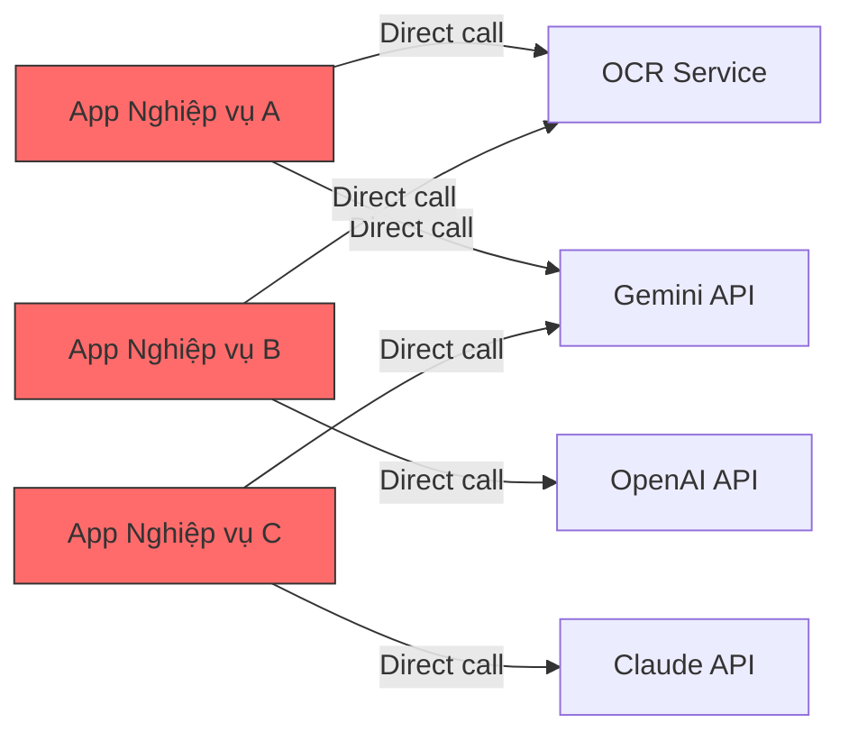

**Vấn đề nhận diện:**

| # | Vấn đề | Ảnh hưởng |
|---|--------|-----------|
| P1 | Mỗi app tự tích hợp AI → N×M integrations | Chi phí bảo trì tăng tuyến tính |
| P2 | Không kiểm soát prompt/model tập trung | Rủi ro prompt injection, output inconsistency |
| P3 | Không có audit trail trên API gọi AI | Vi phạm compliance nội bộ |
| P4 | Không có spending limit per-team | Chi phí AI vượt tầm kiểm soát |
| P5 | Key rotation phải cập nhật tất cả apps | Downtime trên diện rộng |

### 2.2 Mục tiêu (TO-BE)

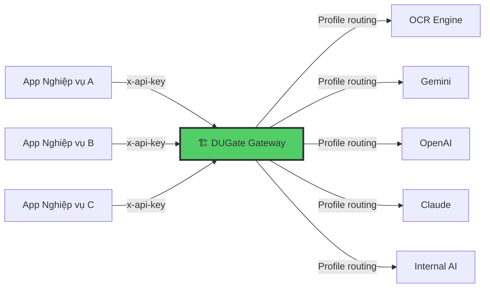

---

## 3. Solution Overview

### 3.1 Kiến trúc Logic — 6 Unified Endpoints

DUGate quy chuẩn hóa toàn bộ bài toán Document Understanding thành **6 hành động ngữ nghĩa** (semantic actions):

| # | Endpoint | Chức năng | Sub-cases |
|---|----------|-----------|-----------|
| 1 | `/api/v1/ingest` | Đọc, OCR, số hóa tài liệu | `parse`, `ocr`, `digitize`, `split` |
| 2 | `/api/v1/extract` | Trích xuất dữ liệu có cấu trúc | `invoice`, `contract`, `id-card`, `receipt`, `table`, `custom` |
| 3 | `/api/v1/analyze` | Đánh giá, phân loại, fact-check | `classify`, `sentiment`, `compliance`, `fact-check`, `quality`, `risk`, `summarize-eval` |
| 4 | `/api/v1/transform` | Chuyển đổi, dịch thuật, mã hóa PII | `convert`, `translate`, `rewrite`, `redact`, `template` |
| 5 | `/api/v1/generate` | Sinh nội dung mới (tóm tắt, QA) | `summary`, `qa`, `outline`, `report`, `email`, `minutes` |
| 6 | `/api/v1/compare` | So sánh ngữ nghĩa/text diff | `diff`, `semantic`, `version` |

### 3.2 Core Architecture Pattern

```
Client Request → Middleware (Auth) → Endpoint Runner (Routing) → Pipeline Submit → Pipeline Engine → External API Processor → AI Backend
       ↑                                                                                                                        ↓
       └──────────────────── Operation Polling / Webhook ←────── PostgreSQL (State Machine) ←──────────────────────────────────┘
```

---

## 4. Architecture Principles

| # | Nguyên tắc | Mô tả |
|---|-----------|------|
| AP-1 | **Gateway Abstraction** | Ứng dụng nghiệp vụ KHÔNG bao giờ gọi trực tiếp AI backend. DUGate là điểm truy cập duy nhất. |
| AP-2 | **Profile-Driven Isolation** | Mỗi API Key sở hữu một cấu hình Profile riêng biệt (model, prompt, connector routing) — thay đổi không ảnh hưởng key khác. |
| AP-3 | **Async-First** | Mọi pipeline mặc định bất đồng bộ (`202 Accepted`). Hỗ trợ `?sync=true` cho trường hợp đặc biệt. |
| AP-4 | **Zero Client Code Change** | Thay đổi AI backend, prompt, model chỉ cần admin thao tác trên Dashboard — 0 dòng code ứng dụng thay đổi. |
| AP-5 | **Auditable** | Mọi request → AI backend đều được ghi log cURL command, correlation ID, latency, token usage. |
| AP-6 | **Defence in Depth** | Tầng auth kép: NextAuth (Admin UI) + API Key HMAC (Public API). AES-256-GCM cho secrets. |

---

## 5. System Context (C4 Level 1)

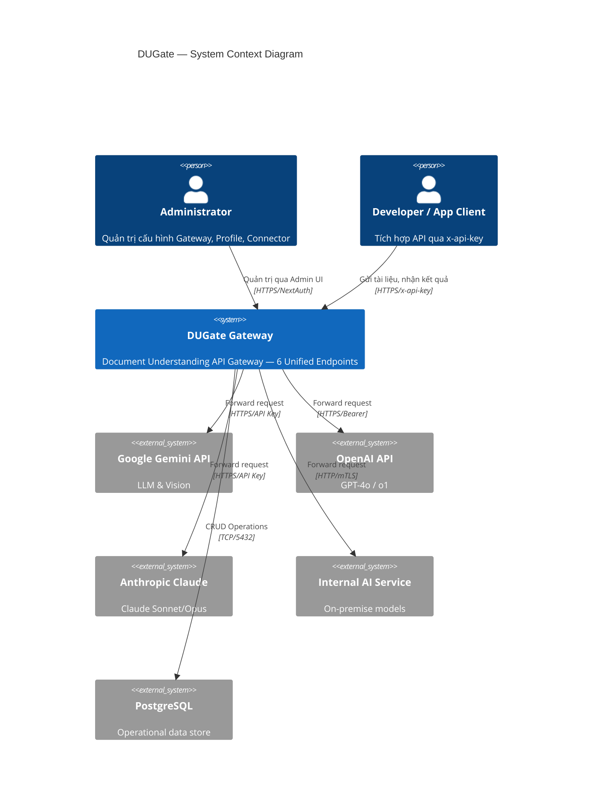

---

## 6. Container Architecture (C4 Level 2)

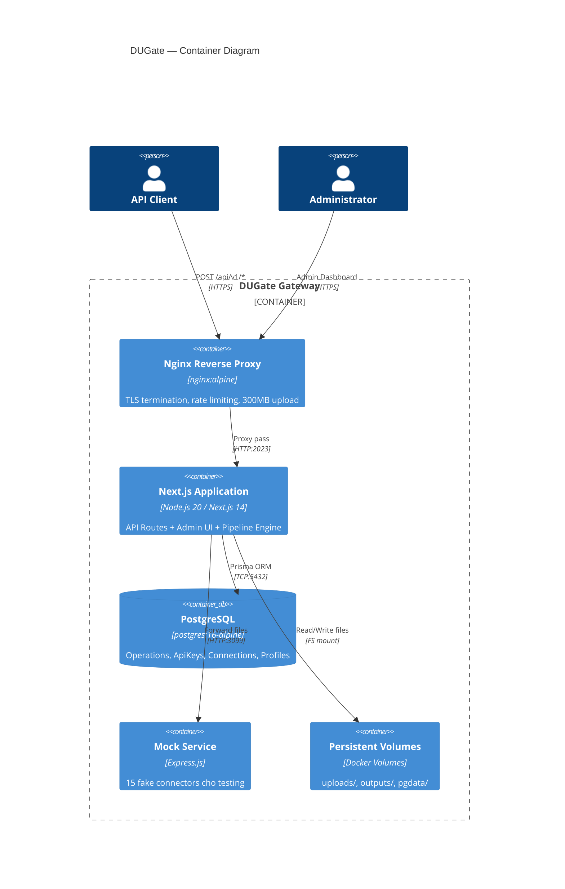

### 6.1 Container Responsibility Matrix

| Container | Responsibility | Port | Image |
|-----------|---------------|------|-------|
| **nginx** | TLS termination, rate-limit, upload size cap (300MB), X-Forwarded headers | 80/443 | `nginx:alpine` |
| **app (Next.js)** | API routing, auth middleware, pipeline engine, admin UI, webhook dispatcher | 2023 | Custom `node:20-slim` multi-stage |
| **db (PostgreSQL)** | Operation state machine, API Key store, connection registry | 5432 | `postgres:16-alpine` |
| **mock-service** | Simulates 15 AI connectors cho E2E testing (không triển khai production) | 3099 | Custom `node:20-alpine` |

---

## 7. Component Architecture (C4 Level 3)

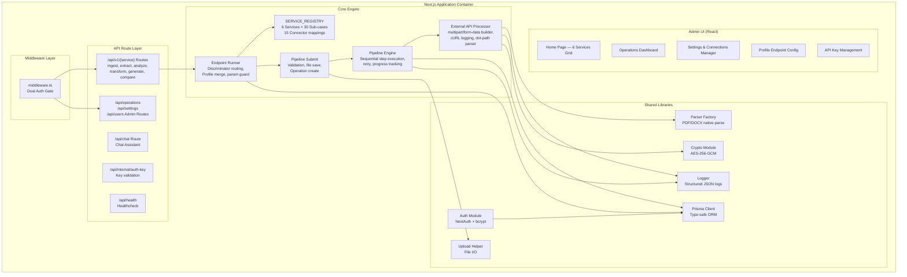

### 7.1 SERVICE_REGISTRY — Connector Mapping

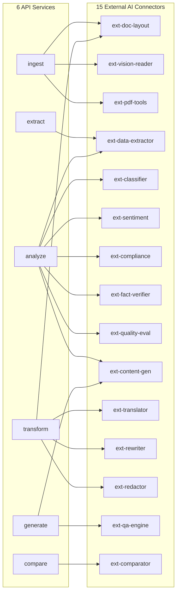

---

## 8. Data Architecture

### 8.1 Entity Relationship Diagram

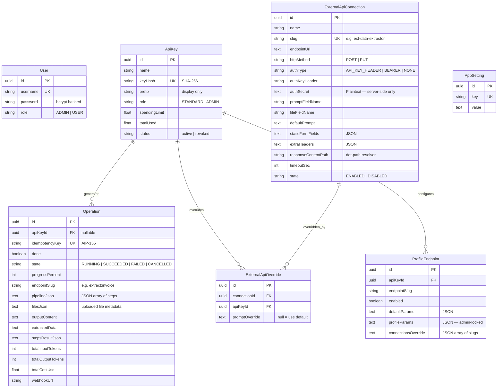

### 8.2 Data Flow Classification

| Dữ liệu | Sensitivity | Encryption | Retention |
|----------|------------|-----------|-----------|
| API Key (raw) | **CRITICAL** | SHA-256 hash, chỉ lưu hash | Permanent |
| Auth Secrets (AI API Keys) | **CRITICAL** | AES-256-GCM at-rest | Permanent |
| Uploaded Files | HIGH | At-rest (volume encryption) | 24h (auto-cleanup) |
| Operation Results | MEDIUM | TLS in-transit | 30 days |
| User Passwords | **CRITICAL** | bcrypt (cost=10) | Permanent |
| Structured Logs | MEDIUM | N/A | 90 days |

---

## 9. Sequence Diagrams

### 9.1 Luồng xử lý API Request (Async — Production Flow)

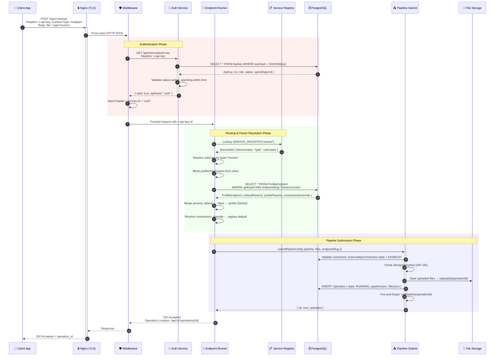

### 9.2 Pipeline Engine — Multi-Step Execution

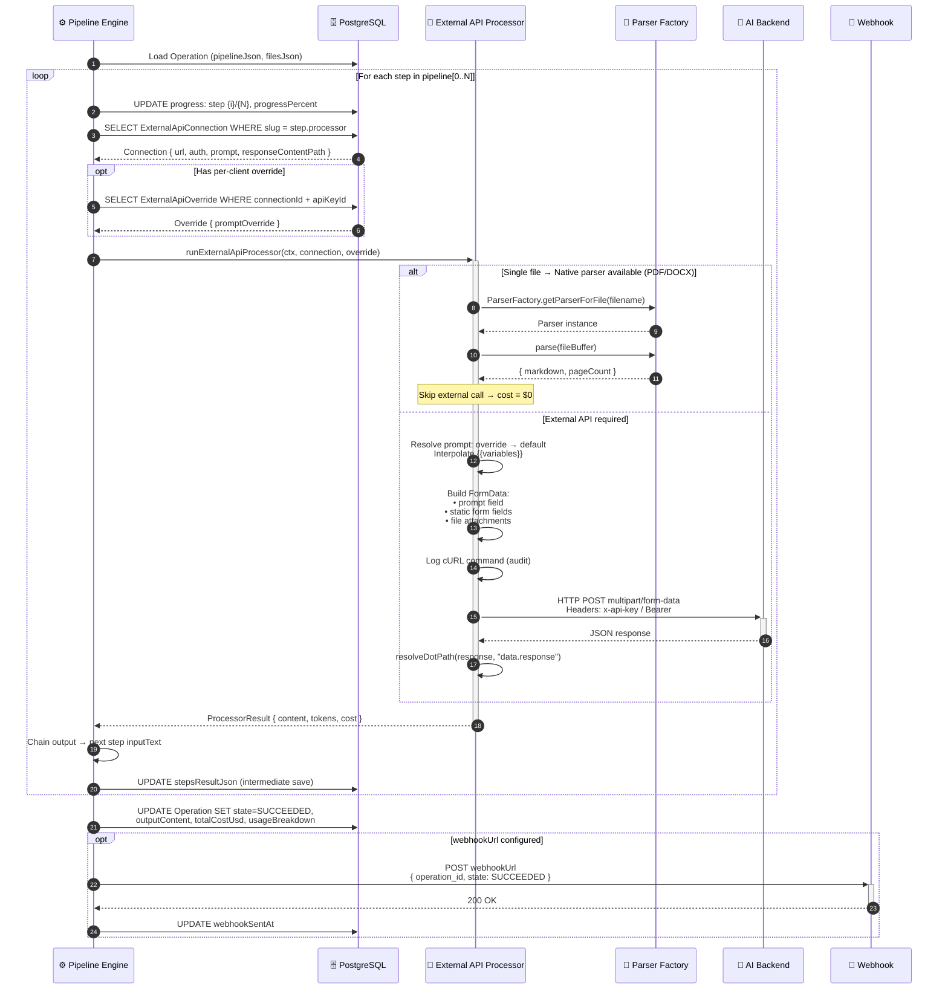

### 9.3 Operation Polling — Client-side

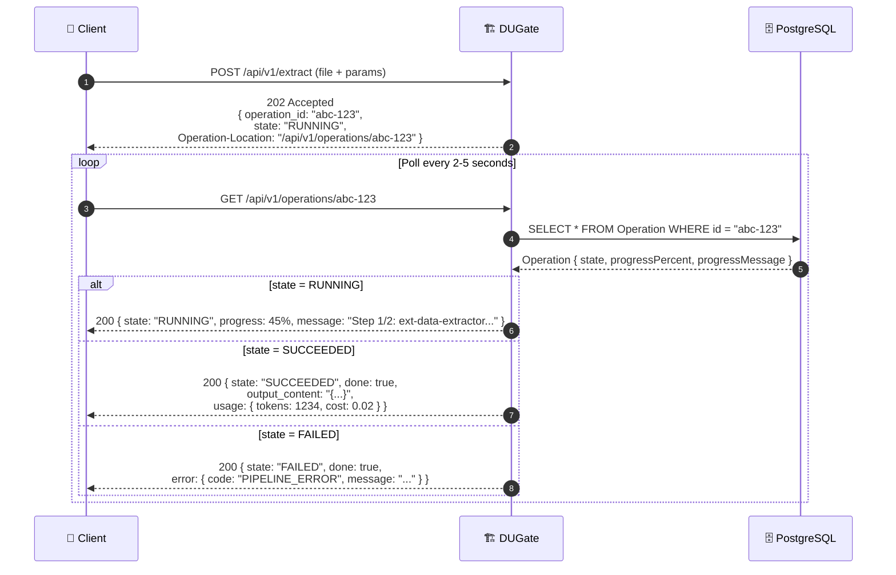

### 9.4 Per-Profile Connector Routing Override

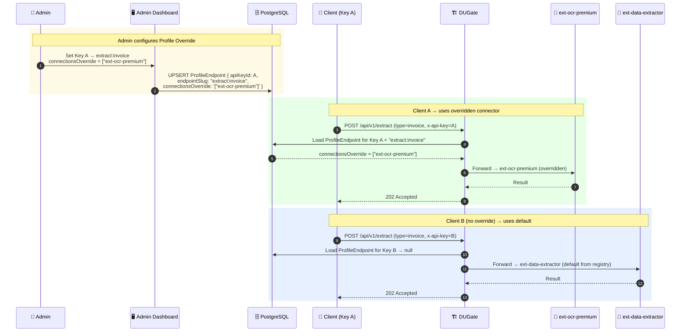

### 9.5 Admin Authentication — NextAuth Session Flow

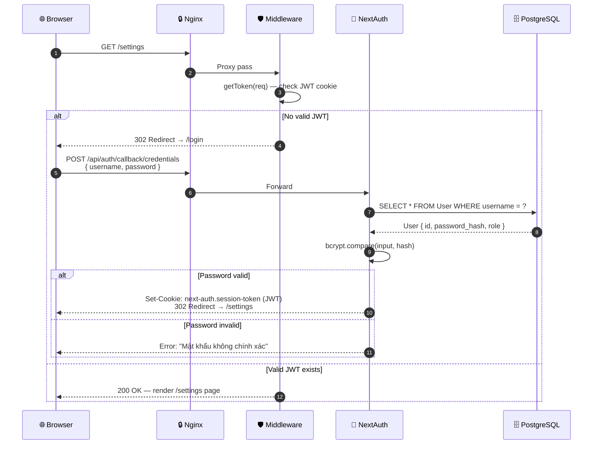

---

## 10. Deployment Architecture — Docker & Kubernetes

### 10.1 Docker Compose — Development / Staging

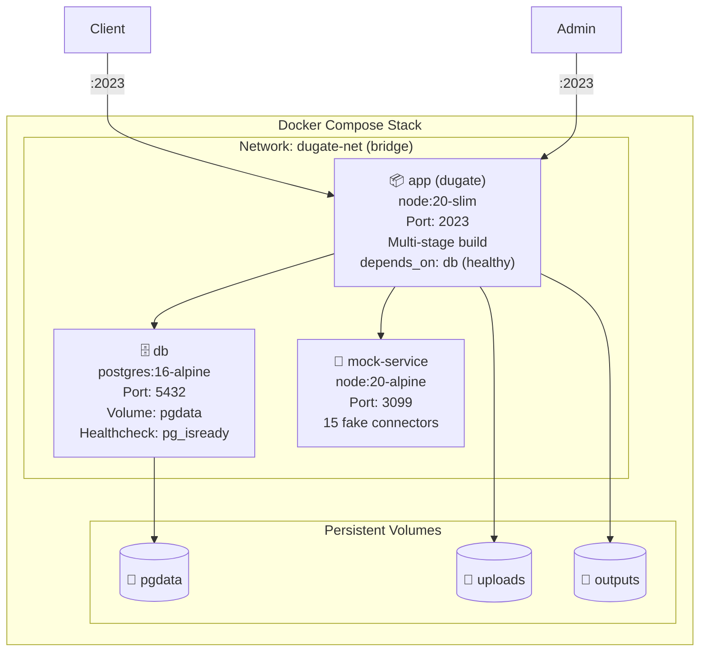

**Docker Compose Configuration hiện tại:**

```yaml
services:
  app:
    build: .                    # Multi-stage Dockerfile
    ports: ["2023:2023"]
    environment:
      DATABASE_URL: postgresql://dugate:${DB_PASSWORD}@db:5432/dugate
      NEXTAUTH_SECRET: ${NEXTAUTH_SECRET}
      ENCRYPTION_KEY: ${ENCRYPTION_KEY}
    volumes:
      - uploads:/app/uploads
      - outputs:/app/outputs
    depends_on:
      db:
        condition: service_healthy

  db:
    image: postgres:16-alpine
    volumes: [pgdata:/var/lib/postgresql/data]
    healthcheck:
      test: pg_isready -U dugate
      interval: 5s

  mock-service:               # DEV/TEST only — NOT in production
    build: ./mock-service
    ports: ["3099:3099"]
```

### 10.2 Multi-Stage Dockerfile Architecture

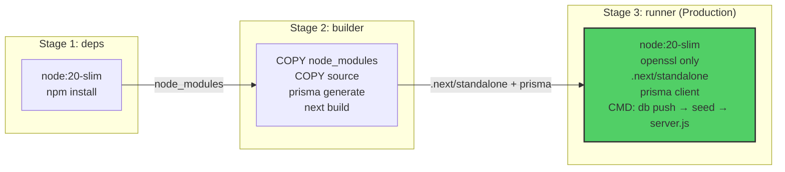

**Design Decision**: Multi-stage build giảm image size từ ~1.2GB → ~350MB bằng cách chỉ copy `.next/standalone` output và Prisma client vào runner stage. Runtime không cần devDependencies.

### 10.3 Kubernetes Deployment — Production

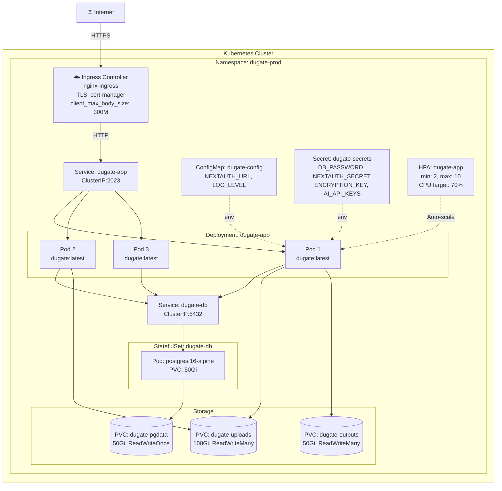

### 10.4 Kubernetes Manifest Specifications

#### Deployment — dugate-app

```yaml
apiVersion: apps/v1
kind: Deployment
metadata:
  name: dugate-app
  namespace: dugate-prod
  labels:
    app: dugate
    component: gateway
spec:
  replicas: 3
  strategy:
    type: RollingUpdate
    rollingUpdate:
      maxSurge: 1
      maxUnavailable: 0    # Zero-downtime deployment
  selector:
    matchLabels:
      app: dugate
  template:
    metadata:
      labels:
        app: dugate
        component: gateway
    spec:
      containers:
        - name: dugate
          image: registry.internal/dugate:latest
          ports:
            - containerPort: 2023
          env:
            - name: DATABASE_URL
              valueFrom:
                secretKeyRef:
                  name: dugate-secrets
                  key: DATABASE_URL
            - name: NEXTAUTH_SECRET
              valueFrom:
                secretKeyRef:
                  name: dugate-secrets
                  key: NEXTAUTH_SECRET
            - name: ENCRYPTION_KEY
              valueFrom:
                secretKeyRef:
                  name: dugate-secrets
                  key: ENCRYPTION_KEY
            - name: UPLOAD_DIR
              value: /app/uploads
            - name: OUTPUT_DIR
              value: /app/outputs
            - name: NODE_ENV
              value: production
            - name: LOG_FORMAT
              value: json
          volumeMounts:
            - name: uploads
              mountPath: /app/uploads
            - name: outputs
              mountPath: /app/outputs
          resources:
            requests:
              cpu: "250m"
              memory: "512Mi"
            limits:
              cpu: "1000m"
              memory: "2Gi"
          livenessProbe:
            httpGet:
              path: /api/health
              port: 2023
            initialDelaySeconds: 30
            periodSeconds: 30
          readinessProbe:
            httpGet:
              path: /api/health
              port: 2023
            initialDelaySeconds: 10
            periodSeconds: 10
      volumes:
        - name: uploads
          persistentVolumeClaim:
            claimName: dugate-uploads
        - name: outputs
          persistentVolumeClaim:
            claimName: dugate-outputs
```

#### StatefulSet — PostgreSQL

```yaml
apiVersion: apps/v1
kind: StatefulSet
metadata:
  name: dugate-db
  namespace: dugate-prod
spec:
  serviceName: dugate-db
  replicas: 1
  selector:
    matchLabels:
      app: dugate-db
  template:
    spec:
      containers:
        - name: postgres
          image: postgres:16-alpine
          ports:
            - containerPort: 5432
          env:
            - name: POSTGRES_USER
              value: dugate
            - name: POSTGRES_PASSWORD
              valueFrom:
                secretKeyRef:
                  name: dugate-secrets
                  key: DB_PASSWORD
            - name: POSTGRES_DB
              value: dugate
          volumeMounts:
            - name: pgdata
              mountPath: /var/lib/postgresql/data
          resources:
            requests:
              cpu: "250m"
              memory: "512Mi"
            limits:
              cpu: "500m"
              memory: "1Gi"
          livenessProbe:
            exec:
              command: ["pg_isready", "-U", "dugate"]
            periodSeconds: 15
  volumeClaimTemplates:
    - metadata:
        name: pgdata
      spec:
        accessModes: ["ReadWriteOnce"]
        resources:
          requests:
            storage: 50Gi
```

#### HorizontalPodAutoscaler

```yaml
apiVersion: autoscaling/v2
kind: HorizontalPodAutoscaler
metadata:
  name: dugate-app-hpa
  namespace: dugate-prod
spec:
  scaleTargetRef:
    apiVersion: apps/v1
    kind: Deployment
    name: dugate-app
  minReplicas: 2
  maxReplicas: 10
  metrics:
    - type: Resource
      resource:
        name: cpu
        target:
          type: Utilization
          averageUtilization: 70
    - type: Resource
      resource:
        name: memory
        target:
          type: Utilization
          averageUtilization: 80
```

#### Ingress

```yaml
apiVersion: networking.k8s.io/v1
kind: Ingress
metadata:
  name: dugate-ingress
  namespace: dugate-prod
  annotations:
    cert-manager.io/cluster-issuer: letsencrypt-prod
    nginx.ingress.kubernetes.io/proxy-body-size: "300m"
    nginx.ingress.kubernetes.io/proxy-read-timeout: "300"
    nginx.ingress.kubernetes.io/proxy-send-timeout: "300"
spec:
  ingressClassName: nginx
  tls:
    - hosts:
        - dugate.internal.bank.vn
      secretName: dugate-tls
  rules:
    - host: dugate.internal.bank.vn
      http:
        paths:
          - path: /
            pathType: Prefix
            backend:
              service:
                name: dugate-app
                port:
                  number: 2023
```

### 10.5 CI/CD Pipeline

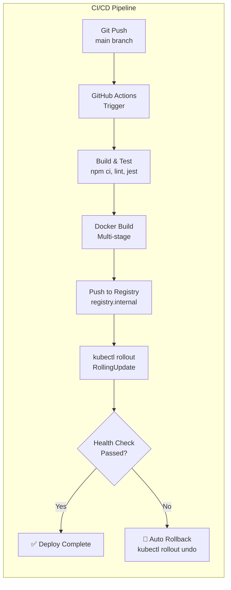

---

## 11. Security Architecture

### 11.1 Defense-in-Depth Layers

```mermaid
graph TB
    subgraph "Layer 1: Network"
        L1[TLS 1.3 — cert-manager<br/>HTTPS enforcement<br/>Network Policy isolation]
    end

    subgraph "Layer 2: Edge"
        L2[Nginx — Rate limiting<br/>Upload size cap: 300MB<br/>X-Forwarded headers<br/>CORS policy]
    end

    subgraph "Layer 3: Application Auth"
        L3[Dual Auth Gate:<br/>• Admin UI → NextAuth JWT (bcrypt)<br/>• Public API → x-api-key HMAC SHA-256<br/>• profileOnlyParams blocked from client]
    end

    subgraph "Layer 4: Data Protection"
        L4[AES-256-GCM for secrets at-rest<br/>bcrypt cost=10 for passwords<br/>API Key only stored as hash<br/>Secrets never in logs]
    end

    subgraph "Layer 5: Audit & Compliance"
        L5[Structured JSON logging<br/>cURL reconstruction per request<br/>Correlation ID end-to-end<br/>Token usage tracking per key]
    end

    L1 --> L2 --> L3 --> L4 --> L5
```

### 11.2 Authentication Matrix

| Endpoint Pattern | Auth Method | Token / Key | Session Type |
|-----------------|-------------|-------------|--------------|
| `/api/v1/*` | API Key Header | `x-api-key` → SHA-256 → DB lookup | Stateless |
| `/api/auth/*` | NextAuth Credentials | username + bcrypt password | JWT cookie |
| `/api/internal/*` | Internal only (middleware bypass) | N/A — only callable by middleware | N/A |
| `/api/health` | None (public) | N/A | N/A |
| `/*` (pages) | NextAuth JWT | Session cookie | JWT |

### 11.3 Secrets Management

| Secret | Storage | Rotation Strategy |
|--------|---------|-------------------|
| `DB_PASSWORD` | K8s Secret / `.env` | Quarterly, zero-downtime via pg_hba reload |
| `NEXTAUTH_SECRET` | K8s Secret | Requires re-login for all admin sessions |
| `ENCRYPTION_KEY` | K8s Secret | Requires re-encrypt all ExternalApiConnection.authSecret |
| AI API Keys | DB (AES-256-GCM encrypted) | Admin changes via Dashboard — no deployment needed |
| `x-api-key` (client) | Client-managed | Admin revokes + issues new key via Dashboard |

---

## 12. Non-Functional Requirements (NFR)

| NFR | Target | Implementation |
|-----|--------|---------------|
| **Availability** | 99.9% uptime | K8s replicas ≥ 2, RollingUpdate zero-downtime, PG healthcheck |
| **Latency (P95)** | < 500ms (gateway overhead) | Direct proxy, no message queue, async pipeline |
| **Throughput** | 100 req/s sustained | HPA auto-scale 2→10 pods, connection pooling via Prisma |
| **Max upload** | 300MB per file | Nginx `client_max_body_size`, K8s Ingress annotation |
| **Pipeline timeout** | 300s per connector step | Per-connector `timeoutSec` config, AbortController |
| **Data retention** | Files: 24h, Operations: 30d | Cleanup scheduler cron + `filesDeleted` flag |
| **Recovery (RPO/RTO)** | RPO: 1h, RTO: 15min | PG WAL archival, PVC snapshots, rollout undo |
| **Observability** | Full structured logging | JSON log format, correlation ID, cURL audit trail |
| **Scalability** | Horizontal only | Stateless app pods, shared PVC for uploads |

---

## 13. Technology Stack Decision Matrix

| Layer | Technology | Lý do chọn | Thay thế đã xem xét |
|-------|-----------|-----------|---------------------|
| **Runtime** | Node.js 20 LTS | Ecosystem Next.js, async I/O native, low-memory footprint | Deno (immature ecosystem) |
| **Framework** | Next.js 14 App Router | SSR admin UI + API routes cùng codebase, chuẩn Vercel | Express.js (không có SSR), NestJS (over-engineering) |
| **Database** | PostgreSQL 16 | ACID, JSONB native, Prisma first-class support, mature | MySQL (JSONB yếu), MongoDB (không ACID) |
| **ORM** | Prisma 5 | Type-safe schema, auto-migration, connection pooling | TypeORM (less type-safe), Drizzle (younger ecosystem) |
| **Auth** | NextAuth v4 + bcryptjs | Native Next.js integration, JWT stateless, credential provider | Passport.js (not Next-native), Clerk (SaaS dependency) |
| **Encryption** | AES-256-GCM (native crypto) | Zero-dependency, NIST approved, authenticated encryption | Vault (infrastructure overhead) |
| **Container** | Docker + multi-stage build | 350MB production image, reproducible builds | Podman (less tooling) |
| **Orchestration** | Kubernetes | HPA, rolling update, secret management, network policy | Docker Swarm (limited auto-scaling) |
| **Reverse Proxy** | Nginx | TLS termination, rate-limit, mature config | Traefik (auto-discovery overkill for single service) |
| **AI Integration** | HTTP multipart/form-data | Provider-agnostic, no SDK lock-in | SDK per-provider (tight coupling) |

---

## 14. Risk Assessment & Mitigation

| # | Risk | Probability | Impact | Mitigation |
|---|------|------------|--------|-----------|
| R1 | Single DB failure → full outage | Medium | **Critical** | PG StatefulSet + PVC snapshot + WAL archival. Roadmap: read-replica. |
| R2 | AI provider rate-limit / downtime | High | High | Multi-connector routing — admin can switch backend in seconds via Dashboard. Retry with fallback connector (roadmap). |
| R3 | File upload storage exhaustion | Medium | Medium | 24h auto-cleanup scheduler. Alert khi PVC usage > 80%. |
| R4 | Prompt injection from client | Medium | High | `profileOnlyParams` blocked at Endpoint Runner. Admin-locked `promptOverride` per-key. Client cannot modify system prompt. |
| R5 | Key leak from logs | Low | **Critical** | cURL logging masks auth headers. API keys stored as SHA-256 hash only. |
| R6 | Pipeline stuck (infinite execution) | Low | Medium | Per-connector `timeoutSec` + AbortController. Operation state = FAILED after timeout. |
| R7 | Horizontal scaling — file access conflict | Medium | Medium | ReadWriteMany PVC (NFS/EFS). Each operation has unique subdirectory. |

---

## 15. Approval Sign-off

| Vai trò | Họ tên | Ngày | Chữ ký |
|---------|--------|------|--------|
| **Solution Architect** | | | |
| **Technical Lead** | | | |
| **Security Officer** | | | |
| **Infrastructure Lead** | | | |
| **Project Manager** | | | |

---

> **Document Control**  
> - v1.0 (2026-04-03): Initial draft — full architecture with sequence diagrams, Docker & K8s deployment  
> - Next review: Pending approval feedback

---

*DUGate — Kiến trúc chuẩn hóa truy cập Document AI cho doanh nghiệp.*
