# AISkillHub — Solution Architecture Document

> **Document ID**: SA-AISkillHub-2026-002
> **Version**: 2.1
> **Classification**: INTERNAL — FOR APPROVAL
> **Author**: Solution Architecture Team
> **Date**: 2026-04-13
> **Status**: APPROVED

---

## Table of Contents

1. [Executive Summary](#1-executive-summary)
2. [Business Context & Problem Statement](#2-business-context--problem-statement)
3. [Solution Overview](#3-solution-overview)
4. [Architecture Principles](#4-architecture-principles)
5. [System Context (C4 Level 1)](#5-system-context-c4-level-1)
6. [Container Architecture (C4 Level 2)](#6-container-architecture-c4-level-2)
7. [Component Architecture (C4 Level 3)](#7-component-architecture-c4-level-3)
8. [Sequence Diagrams](#8-sequence-diagrams)
9. [Deployment Architecture — Docker & Kubernetes](#9-deployment-architecture--docker--kubernetes)
10. [Security Architecture](#10-security-architecture)
11. [Non-Functional Requirements (NFR)](#11-non-functional-requirements-nfr)
12. [Technology Stack Decision Matrix](#12-technology-stack-decision-matrix)
13. [Approval Sign-off](#13-approval-sign-off)

---

## 1. Executive Summary

**AISkillHub** (Document Understanding API Gateway) là giải pháp kiến trúc cổng trung gian API nội bộ, chuyên xử lý các bài toán **Phân tích Tài liệu** (Document Understanding) cho môi trường doanh nghiệp — đặc biệt phù hợp với ngành Tài chính & Ngân hàng.

Thay vì mỗi nghiệp vụ tự tích hợp riêng lẻ đến hàng chục dịch vụ AI, AISkillHub **quy chuẩn hóa** toàn bộ lớp truy cập thành **6 API Endpoint + Workflow API**, vận hành trên kiến trúc **BullMQ Async Worker** với khả năng **Human-in-the-Loop (HITL)** và **Code-Driven Workflow Orchestration**, đảm bảo:

- **Zero-coupling** giữa ứng dụng nghiệp vụ và AI backend
- **Multi-tenant isolation** qua API Key + Profile-based routing + 3-tier Prompt Override
- **Human-in-the-Loop**: Tạm dừng pipeline để con người duyệt, chỉnh sửa, rồi resume
- **Audit-grade traceability** với structured logging & cURL reconstruction
- **Enterprise-grade deployment** trên Docker & Kubernetes với BullMQ job dashboard

### Thay đổi chính từ v2.0 → v2.1

| # | Thay đổi | Mô tả |
|---|---------|-------|
| 1 | **BullMQ Worker** | Tách Worker thành container độc lập; pipeline jobs chạy qua Redis queue thay vì fire-and-forget trong Next.js process |
| 2 | **Workflow Engine** | Bổ sung `workflow-engine.ts` — lớp orchestration code-driven song song với Standard Pipeline Engine |
| 3 | **HITL Pause/Resume** | Workflow có thể tạm dừng (`WAITING_USER_INPUT`), nhận dữ liệu chỉnh sửa từ con người, rồi tiếp tục từ đúng checkpoint |
| 4 | **3-tier Prompt System** | Code Prompt > Profile Override (UI) > DB Connector Default — được resolve qua `_workflowPrompts` param |
| 5 | **Mock Service Container** | Container `mock-service` phục vụ dev/staging mô phỏng External AI connectors |
| 6 | **parseDeep Utility** | Shared utility xử lý nested JSON từ AI response, export từ `workflow-engine.ts` |

---

## 2. Business Context & Problem Statement

Trong bối cảnh chuyển đổi số, nhu cầu xử lý tài liệu bằng AI (OCR, trích xuất, phân loại, đối soát, v.v.) ngày càng tăng nhanh trên nhiều đơn vị nghiệp vụ. Các mô hình LLM được cung cấp tập trung qua **LLMs Hub** nội bộ. Tuy nhiên, cần **quy hoạch lại** thành một lớp cổng trung gian chuẩn hóa:

| # | Vấn đề | Ảnh hưởng |
|---|--------|-----------|
| P1 | Mỗi app tự tích hợp riêng lẻ → N×M integrations | Chi phí bảo trì tăng tuyến tính |
| P2 | Không kiểm soát prompt/model tập trung | Rủi ro prompt injection, output inconsistency |
| P3 | Không có audit trail trên API gọi AI | Vi phạm compliance nội bộ |
| P4 | Không có spending limit per-team | Token usage vượt tầm kiểm soát |
| P5 | Thiếu cơ chế pipeline chain | Không thể ghép nối OCR → Extract → Validate |
| P6 | Thiếu cơ chế Human Review | Không thể dừng workflow để con người phê duyệt trước khi tiếp tục |

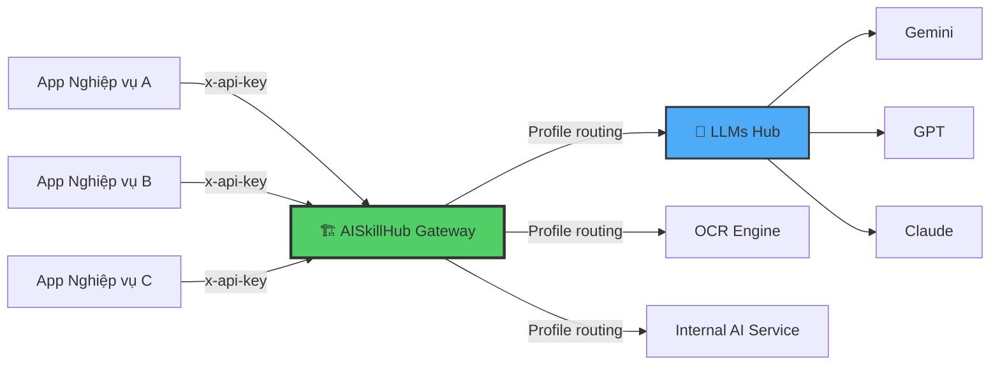

---

## 3. Solution Overview

### 3.1 Hai loại Pipeline

AISkillHub hỗ trợ **2 loại pipeline** với mục đích khác nhau:

#### A. Standard Pipeline Engine (Data Flow — Cấu hình UI)
Chuỗi connector tuần tự được cấu hình qua Admin UI. Phù hợp cho nghiệp vụ đơn luồng, không cần logic phức tạp.

```
Request → Endpoint Runner → Submit → BullMQ Queue
                                           ↓
                                 Worker: engine.ts
                                    Step 1 → Step 2 → Step N
                                    (chained input_content)
```

#### B. Workflow Engine (Process Orchestration — Code-Driven)
Orchestration logic được viết bằng TypeScript, hỗ trợ song song, HITL, checkpoint. Phù hợp cho nghiệp vụ phức tạp như giải ngân, thẩm định tài sản.

```
Request → /api/v1/workflows → Submit → BullMQ Queue
                                            ↓
                                 Worker: workflow-engine.ts
                                    WORKFLOW_REGISTRY[process]
                                    Step 1 (parallel classify)
                                    Step 2 (parallel extract)
                                    ──→ PAUSE (HITL) ←── Human reviews
                                    Step 3 (crosscheck)
                                    Step 4 (report generation)
                                    ──→ SUCCEEDED
```

### 3.2 Các Endpoint

| # | Endpoint | Kiểu Pipeline | Chức năng |
|---|----------|--------------|-----------|
| 1 | `POST /api/v1/ingest` | Standard | OCR, số hóa, split tài liệu |
| 2 | `POST /api/v1/extract` | Standard | Trích xuất dữ liệu có cấu trúc |
| 3 | `POST /api/v1/analyze` | Standard | Phân loại, fact-check, sentiment |
| 4 | `POST /api/v1/transform` | Standard | Dịch thuật, rewrite, redact PII |
| 5 | `POST /api/v1/generate` | Standard | Tóm tắt, QA, soạn email |
| 6 | `POST /api/v1/compare` | Standard | So sánh ngữ nghĩa / text diff |
| 7 | `POST /api/v1/workflows` | Workflow | Code-driven multi-step flows (HITL) |

### 3.3 Vòng đời Operation (State Machine)

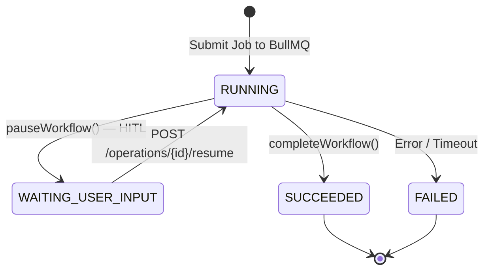

---

## 4. Architecture Principles

| # | Nguyên tắc | Mô tả |
|---|-----------|------|
| AP-1 | **Gateway Abstraction** | Ứng dụng KHÔNG bao giờ gọi trực tiếp AI backend. AISkillHub là điểm duy nhất. |
| AP-2 | **Unified Parameter Guardrails** | Tham số hệ thống bị khóa (locked params) từ chối khi Client cố ghi đè. |
| AP-3 | **Profile-Driven Isolation** | Mỗi API Key có cấu hình prompt/connector riêng, không ảnh hưởng key khác. |
| AP-4 | **Async-First** | Mọi pipeline bất đồng bộ qua BullMQ. API trả 202 ngay lập tức. |
| AP-5 | **Zero Client Code Change** | Thay đổi AI backend, prompt, connector chỉ cần Admin thao tác — 0 dòng code client. |
| AP-6 | **Defence in Depth** | Tầng auth kép: NextAuth (Admin UI) + API Key (Public API). AES-256-GCM cho secrets. |
| AP-7 | **Checkpoint & Resume** | Worker lưu state sau mỗi step. BullMQ retry sẽ tiếp tục từ đúng bước đã fail. |
| AP-8 | **Human-in-the-Loop** | Workflow có thể pause để con người inspect, chỉnh sửa JSON, rồi resume đúng checkpoint. |

---

## 5. System Context (C4 Level 1)

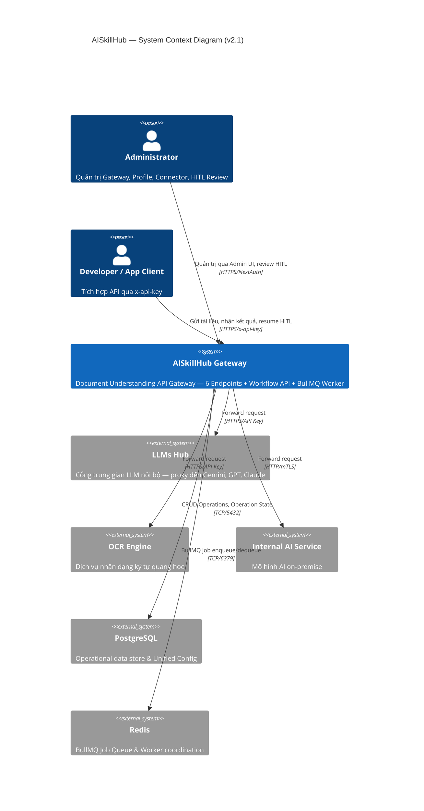

---

## 6. Container Architecture (C4 Level 2)

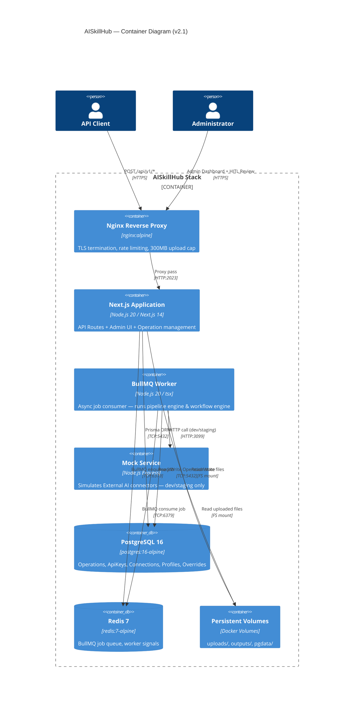

### 6.1 Vai trò từng container

| Container | Image | Vai trò |
|-----------|-------|---------|
| **app** | `vietbn/AISkillHub:4.0.0` | Next.js API + Admin UI. Nhận request, tạo Operation, enqueue BullMQ job, trả 202. |
| **worker** | `vietbn/AISkillHub:4.0.0` (CMD override) | Consumer BullMQ. Chạy `engine.ts` (Standard) hoặc `workflow-engine.ts` (Workflow). |
| **db** | `postgres:16-alpine` | Lưu trữ toàn bộ state. Nguồn sự thật duy nhất. |
| **redis** | `redis:7-alpine` | Job queue cho BullMQ. Worker subscribe qua `BLPOP`. |
| **mock-service** | Custom Express | Mô phỏng External AI API (dev/staging). Port 3099. |

---

## 7. Component Architecture (C4 Level 3)

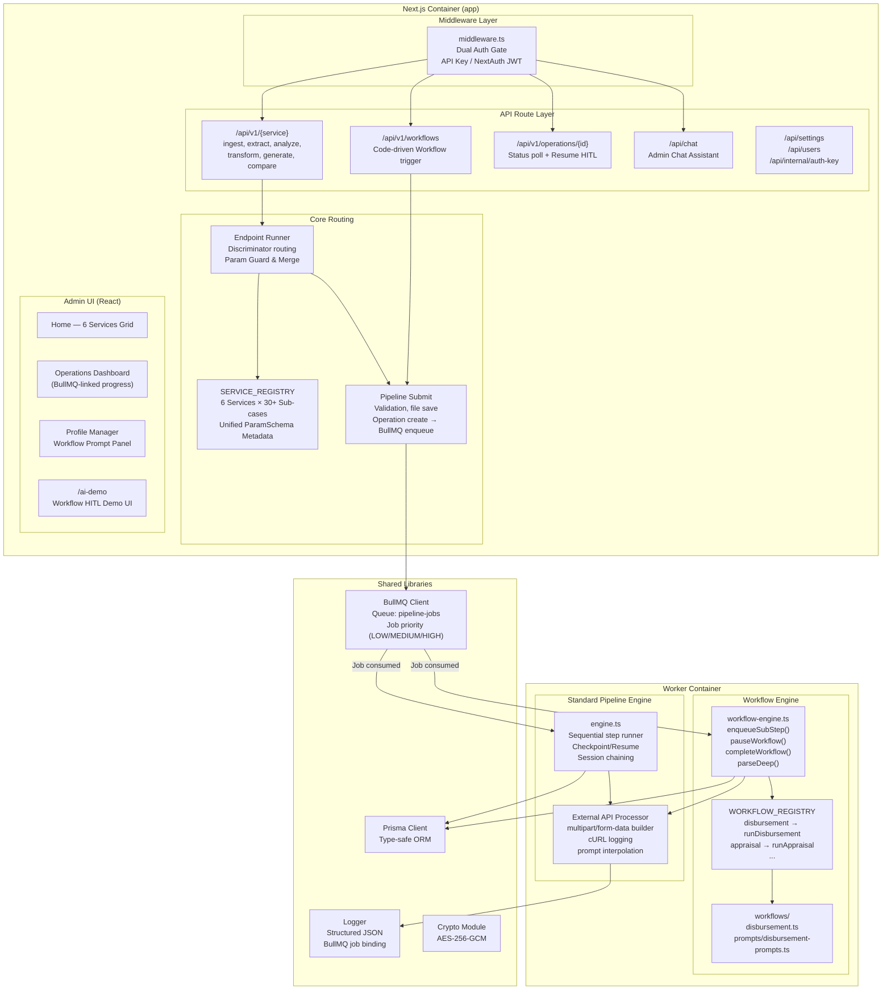

### 7.1 Prompt Override — 3 Tầng ưu tiên

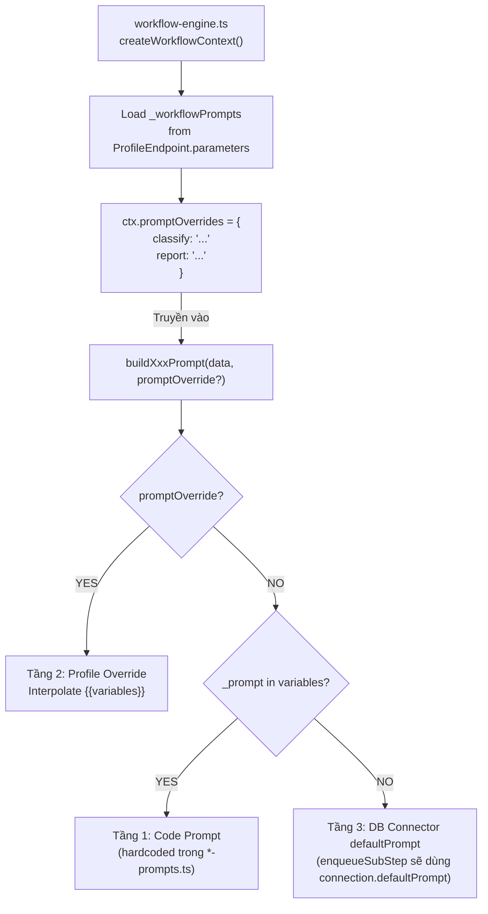

### 7.2 Connectors

| Slug | Vai trò | Dùng tại |
|------|---------|---------|
| `ext-classifier` | Phân loại tài liệu & xác định logical docs | Workflow Step 1, analyze |
| `ext-data-extractor` | Bóc tách dữ liệu có cấu trúc | Workflow Step 2, extract |
| `ext-fact-verifier` | Đối chiếu chéo, compliance check | Workflow Step 3, analyze |
| `ext-content-gen` | Soạn nội dung, báo cáo, tờ trình | Workflow Step 4, generate |
| `ext-doc-layout` | Phân tích layout, OCR | ingest |
| `ext-vision-reader` | Vision/OCR thông minh | ingest |
| `ext-translator` | Dịch thuật | transform |
| `ext-rewriter` | Rewrite, paraphrase | transform |
| `ext-redactor` | Che giấu PII | transform |
| `ext-comparator` | So sánh ngữ nghĩa | compare |
| `sys-assistant` | Admin Chat Assistant | /api/chat |

---

## 8. Sequence Diagrams

### 8.1 BullMQ Standard Pipeline Flow

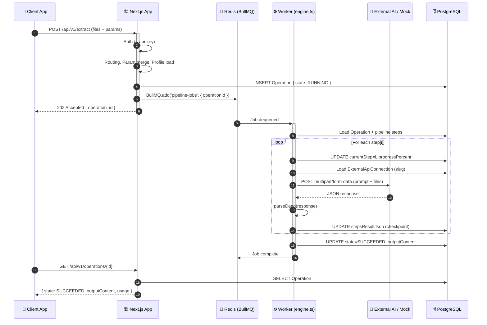

### 8.2 Workflow HITL Flow (Code-Driven)

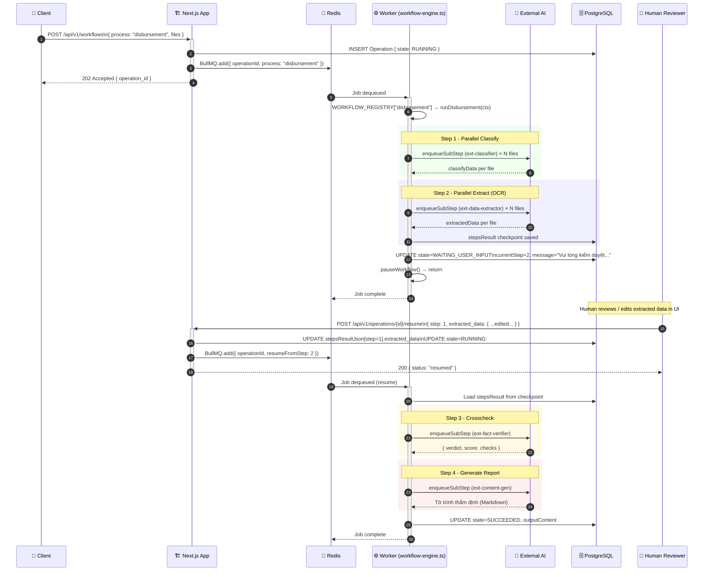

### 8.3 API Request Routing & Param Resolution

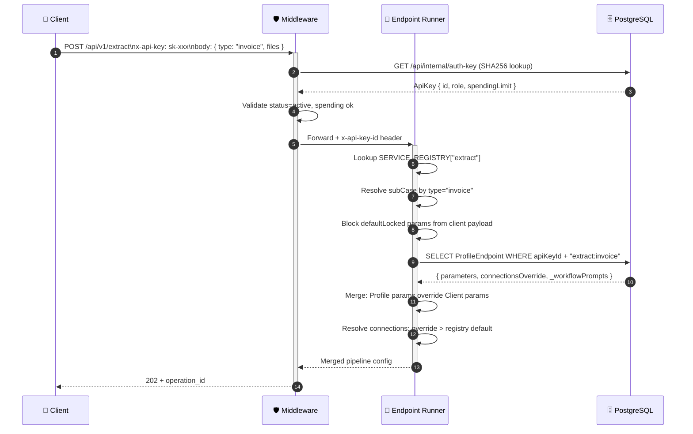

### 8.4 Per-Profile Prompt Override (Workflow)

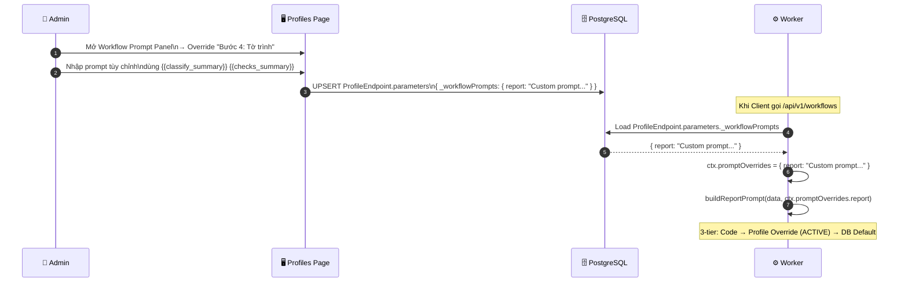

---

## 9. Deployment Architecture — Docker & Kubernetes

### 9.1 Docker Compose Stack (Dev/Staging)

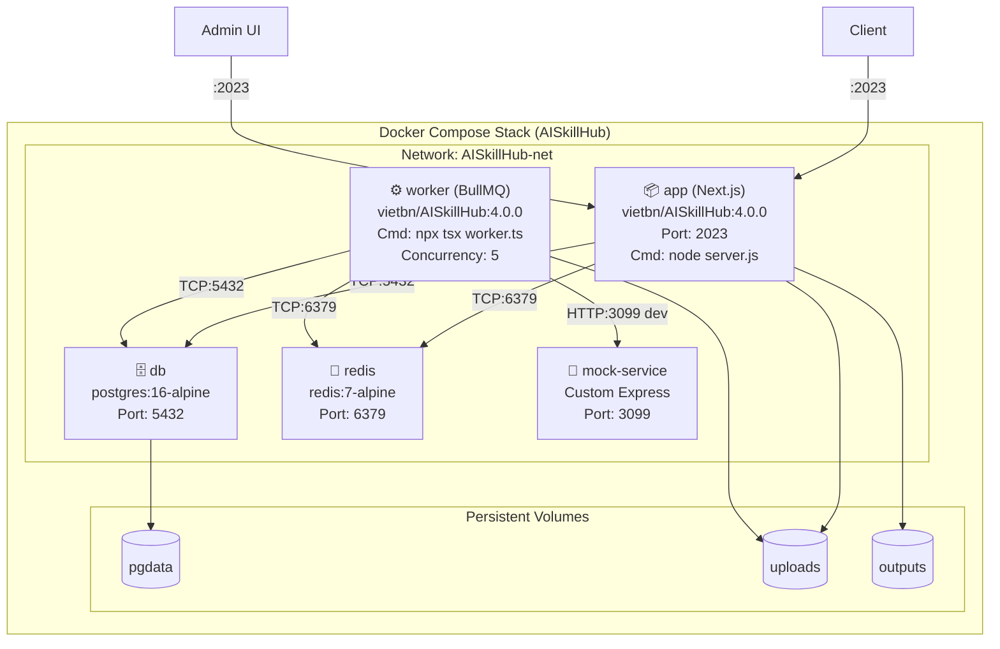

### 9.2 Service Configuration

| Service | Image | Port | Restart | Depends on |
|---------|-------|------|---------|------------|
| **app** | `vietbn/AISkillHub:4.0.0` | 2023 | unless-stopped | db (healthy), redis (healthy) |
| **worker** | `vietbn/AISkillHub:4.0.0` (CMD override) | — | unless-stopped | db (healthy), redis (healthy) |
| **db** | `postgres:16-alpine` | 5432 | unless-stopped | — |
| **redis** | `redis:7-alpine` | 6379 | unless-stopped | — |
| **mock-service** | Custom Express | 3099 | unless-stopped | — (independent) |

### 9.3 Worker Configuration

| ENV | Mặc định | Ý nghĩa |
|-----|---------|---------|
| `REDIS_URL` | `redis://redis:6379` | Kết nối BullMQ |
| `DATABASE_URL` | `postgresql://...` | Prisma connection |
| `WORKER_CONCURRENCY` | `5` | Số job chạy song song |
| `ENCRYPTION_KEY` | Required | Giải mã AI API keys từ DB |

### 9.4 Kubernetes — Production Topology

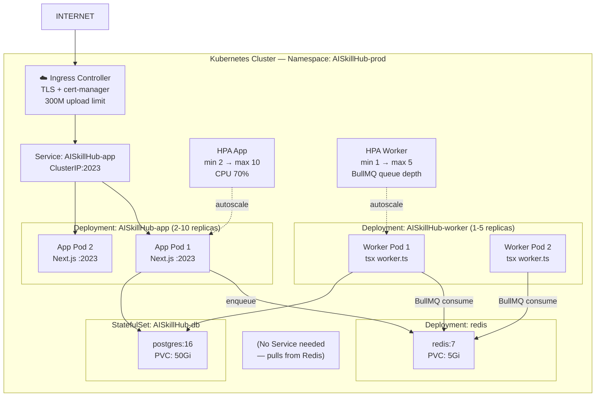

**Điểm mới trong Kubernetes v2.1:**

| Khía cạnh | Cấu hình |
|-----------|---------|
| **Worker scaling** | HPA riêng dựa trên BullMQ queue depth (KEDA metric adapter) |
| **Worker replicas** | Stateless — nhiều worker cùng consume queue, BullMQ đảm bảo at-most-once |
| **App replicas** | Stateless — shared volumes (uploads/outputs) qua PVC ReadWriteMany |
| **Redis** | PVC 5Gi — append-only persistence cho durability |

---

## 10. Security Architecture

### 10.1 Authentication Matrix

| Endpoint Pattern | Auth Method | Token / Key | Session Type |
|-----------------|-------------|-------------|--------------|
| `/api/v1/*` | API Key Header | `x-api-key` → SHA-256 → DB lookup | Stateless |
| `/api/v1/operations/{id}/resume` | API Key Header | Same x-api-key | Stateless |
| `/api/chat` | NextAuth JWT | Cookie | JWT cookie |
| `/api/auth/*` | NextAuth Credentials | username + bcrypt | JWT cookie |
| `/api/internal/*` | Internal only (middleware bypass) | N/A | N/A |
| `/api/health` | None (public) | N/A | N/A |
| `/*` (pages) | NextAuth JWT | Session cookie | JWT |

### 10.2 Prompt Security

| Rủi ro | Biện pháp |
|--------|----------|
| Prompt injection từ Client | `defaultLocked: true` params bị strip trước khi merge |
| Client bypass profile prompt | `isLocked: true` trên `_workflowPrompts` → Client không override được |
| Prompt leak qua log | cURL log chỉ ghi lại metadata, không ghi full prompt content |

### 10.3 Secrets Management

| Secret | Storage | Rotation |
|--------|---------|---------|
| `DB_PASSWORD` | K8s Secret / `.env` | Quarterly |
| `NEXTAUTH_SECRET` | K8s Secret | Requires re-login |
| `ENCRYPTION_KEY` | K8s Secret | Requires re-encrypt DB |
| AI API Keys | DB (AES-256-GCM) | Admin dashboard — no deploy |
| `x-api-key` (client) | Client-managed | Admin revoke + issue |

---

## 11. Non-Functional Requirements (NFR)

| NFR | Target | Implementation |
|-----|--------|---------------|
| **Availability** | 99.9% uptime | K8s replicas ≥ 2, RollingUpdate zero-downtime |
| **Latency (P95)** | < 500ms gateway overhead | Async 202, no blocking in Next.js |
| **Throughput** | 100 req/s sustained | HPA app + worker scaling, BullMQ concurrency |
| **Max upload** | 300MB per file | Nginx `client_max_body_size` |
| **Sub-step timeout** | 120s per sub-step | SUB_STEP_TIMEOUT in workflow-engine, AbortController |
| **Pipeline timeout** | 300s per connector step (Standard) | Per-connector `timeoutSec` |
| **Data retention** | Files: 24h, Operations: 30d | Cleanup scheduler cron |
| **Recovery (RPO/RTO)** | RPO: 1h, RTO: 15min | PG WAL, PVC snapshots, rollout undo |
| **Observability** | Full structured logging | JSON logs, correlationId, BullMQ Dashboard |
| **HITL SLA** | System waits indefinitely | `WAITING_USER_INPUT` persisted in DB |
| **Job at-most-once** | No duplicate execution | BullMQ job ID idempotency |

---

## 12. Technology Stack Decision Matrix

| Layer | Technology | Lý do chọn | Thay thế đã xem xét |
|-------|-----------|-----------|---------------------|
| **Runtime** | Node.js 20 LTS | Ecosystem Next.js, async I/O native | Deno (immature) |
| **Framework** | Next.js 14 App Router | SSR admin UI + API routes cùng codebase | Express.js (no SSR) |
| **Database** | PostgreSQL 16 | ACID, JSONB, Prisma support | MySQL (JSONB yếu) |
| **ORM** | Prisma 5 | Type-safe, auto-migration | TypeORM (less type-safe) |
| **Job Queue** | BullMQ + Redis 7 | Priority queue, retry, dashboard, at-most-once | Sidekiq (Ruby), Celery (Python) |
| **Auth** | NextAuth v4 + bcryptjs | Native Next.js, JWT stateless | Passport.js |
| **Encryption** | AES-256-GCM (native crypto) | Zero-dep, NIST approved | Vault (infra overhead) |
| **Container** | Docker multi-stage | 350MB image | Podman |
| **Orchestration** | Kubernetes | HPA, rolling update, secrets | Docker Swarm (limited scale) |
| **Reverse Proxy** | Nginx | TLS, rate-limit | Traefik |
| **Worker** | tsx (TypeScript executor) | No compile step, hot-reload dev | ts-node, compiled JS |
| **AI Integration** | HTTP multipart/form-data via LLMs Hub | Provider-agnostic, no SDK lock-in | Per-provider SDK |

---

## 13. Approval Sign-off

| Vai trò | Họ tên | Ngày | Chữ ký |
|---------|--------|------|--------|
| **Solution Architect** | | | |
| **Technical Lead** | | | |
| **Security Officer** | | | |
| **Infrastructure Lead** | | | |
| **Project Manager** | | | |

---

> **Document Control**
> - v2.1 (2026-04-13): Cập nhật kiến trúc BullMQ Worker container, Workflow Engine code-driven, HITL pause/resume, 3-tier Prompt Override system, Mock Service, parseDeep utility. Docker image `vietbn/AISkillHub:4.0.0`.
> - v2.0 (2026-04-04): Unified Parameters, ParamSchema Metadata, Chat Assistant integration.
> - v1.0 (2026-04-03): Initial draft — 6 API endpoints, Docker & K8s deployment.
> - Next review: Q2-2026

---

*AISkillHub — Kiến trúc chuẩn hóa truy cập Document AI cho doanh nghiệp.*
